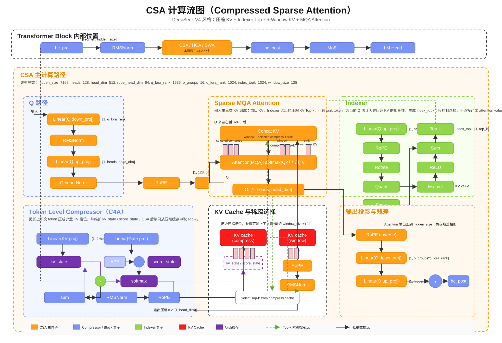

# DeepSeek V4模型简介

## 整体架构

  

## CSA模块计算图

CSA（Compressed Sparse Attention）由压缩器、Indexer和稀疏MQA Attention组成：
- Compressor(C4A)：维护压缩KV缓存和kv_state/score_state。
- Indexer：根据当前Q对压缩KV打分并选出Top-k。
- Attention：拼接window KV、compress Top-k和sink token后执行MQA，并经过O投影回到hidden维度。

可编辑PPT版本：[CSA计算流图.pptx](CSA计算流图.pptx)

  

## 相关资料：
- [DeepSeek V4论文（技术报告）](https://huggingface.co/deepseek-ai/DeepSeek-V4-Pro/blob/main/DeepSeek_V4.pdf)
- [整体介绍](https://mp.weixin.qq.com/s/8bxXqS2R8Fx5-1TLDBiEDg)
- [Pro模型卡片](https://huggingface.co/deepseek-ai/DeepSeek-V4-Pro)
- [Pro模型定义](https://huggingface.co/deepseek-ai/DeepSeek-V4-Pro/blob/main/inference/model.py)
